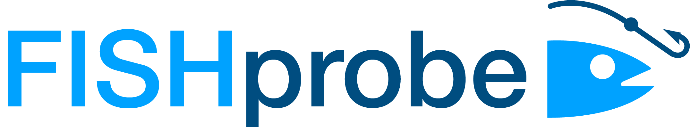
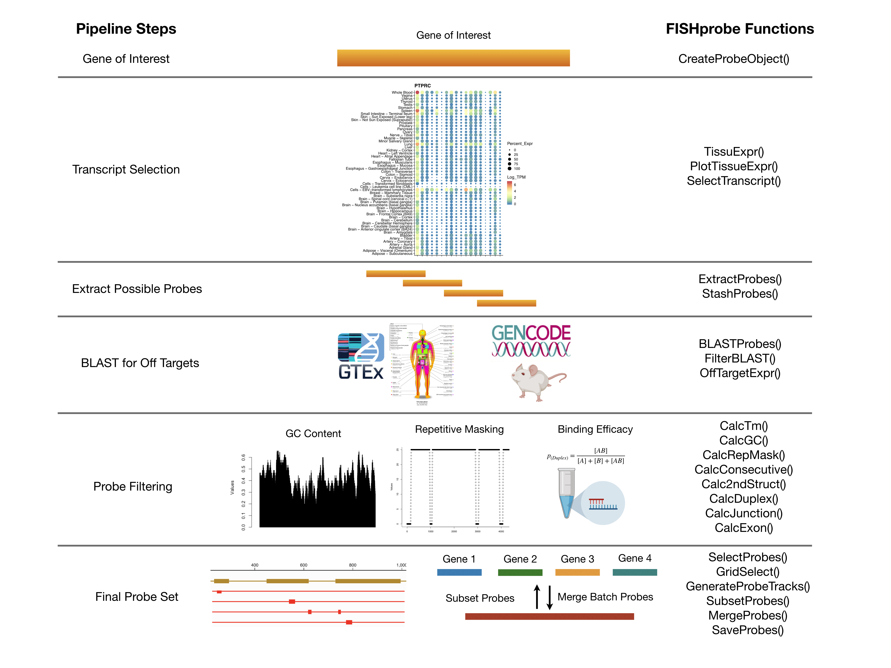
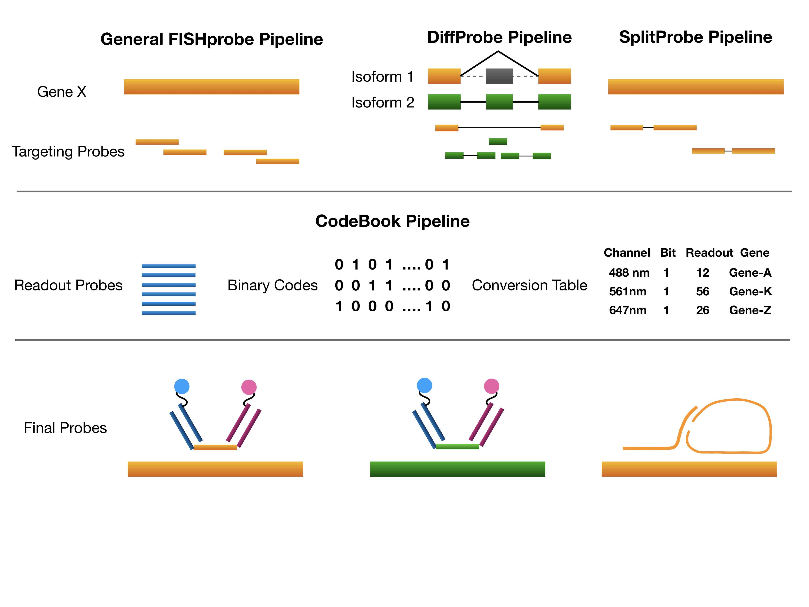

<!-- README.md is generated from README.Rmd. Please edit that file -->
[](https://opensource.org/licenses/MIT)
[](https://travis-ci.com/stevexniu/fishprobe)



FISHprobe v0.4.1
----------------

R package for designing RNA Fluorescence In Situ Hybridization (RNA-FISH) probes that can be used in high-throughput [MERFISH](https://science.sciencemag.org/content/362/6416/eaau5324), [SeqFISH+](https://www.nature.com/articles/s41586-019-1049-y) and [STARmap](https://science.sciencemag.org/content/361/6400/eaat5691) experiments.

-   Version 0.1.0 Beta version with target (encoding) probe design pipeline 08-22-2019
-   Version 0.2.0 updated with readout probe design pipeline 10-03-2019
-   Version 0.3.0 updated with customized sequences and isoform differential sequences 10-16-2019
-   Version 0.4.0 updated with split probe pipeline 11-03-2019

Installation
------------
<del>Install [git lfs](https://github.com/git-lfs/git-lfs/wiki/Installation). And run in command line:

<del>git-lfs clone https://github.com/stevexniu/fishprobe.git

<del>If you don't have `git lfs` installed, you can run in command line:

Open your terminal and git clone FISHprobe repository:
```
git clone https://github.com/stevexniu/fishprobe.git
```
Then, download [GENCODE BLAST database](https://drive.google.com/drive/folders/1zahQ3LXDnxEgpkDVRpKApQCI72d26_VP?usp=sharing), unzip it and add/overwrite the files in the`fishprobe/inst/extdata`folder that you just cloned from github.

Note because some of these BLAST databases are in large size (>300Mb), this way of installation will take 5-10mins. To achieve a fast installation, we recommend to download them in a separate folder and proceed to the following installation process. \
After installation, find the FISHprobe installation R library path or by typing in R/RStudio`.libPaths()`.\
Then copy the downloaded datasets to the`FISHprobe/extdata`folder under that R library path. For instance in your terminal (suppose that`.libPaths()`returns your R library path as`/Library/Frameworks/R.framework/Versions/3.6/Resources/library)`):
```
cp gencode_extdata/* /Library/Frameworks/R.framework/Versions/3.6/Resources/library/FISHprobe/extdata
```
Same recommendation applies for the repetitive masked sequences datasets.

Repetitive sequences removal is included in the pipeline, but if you want to use the repetitive masked sequences for BLAST purpose, you can [download them](https://drive.google.com/drive/folders/1eB5tOZPeFbSw9hwrpMiaXLegpkmeTINP?usp=sharing) and add them to the`fishprobe/inst/extdata`folder. \
You will also need to install [BLAST](https://blast.ncbi.nlm.nih.gov/Blast.cgi?PAGE_TYPE=BlastDocs&DOC_TYPE=Download), [ViennaRNA](https://www.tbi.univie.ac.at/RNA/#download) or [NUPACK](http://www.nupack.org/) down the road.

After you have finished the above steps, open an R session and run the following code to install FISHprobe:
```
install.packages('devtools')
devtools::install('<filepath_to_fishprobe>')
```

Overview
-------


Examples
-------

For target probe design, a basic example can be found in `tutorial/Target-Probes.Rmd`. \
For multiple genes design, the tutorial can be found in `tutorial/Multi-Gene-Probes.Rmd`. \
For readout probe design, the tutorial can be found in `tutorial/Readout-Probes.Rmd`.\
For differential sequences between isoforms, and SplitSeq (SNAIL) probes, the tutorial can be found in `tutorial/Isoform-Probes.Rmd`.\
For running batch mode with multiple genes as input, an example script can be found in `tutorial/Batch-Probes.R`/

Advanced Usage
-------

